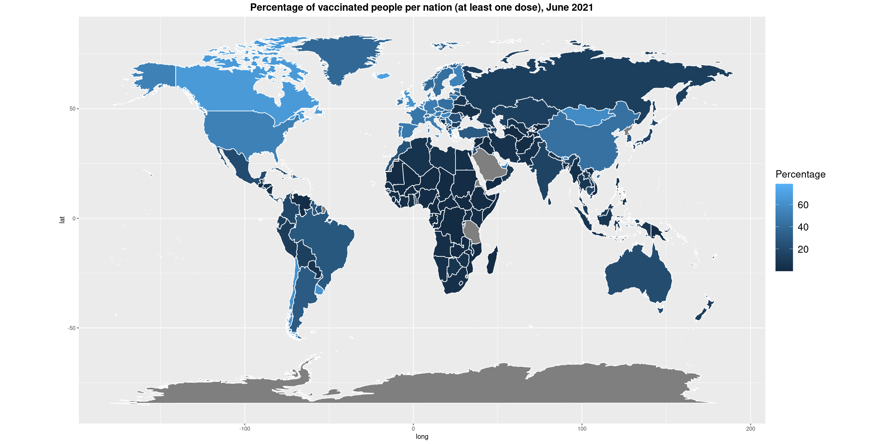

# Inference of COVID-19 vaccine effectiveness and uncertainty using Bayesian methods

    

## Authors

* [**Rinaldi Luca**](https://github.com/RinaldiLuca) (University of Padua)
* **Benassi Federica** (University of Bologna)

## Abstract
In this study we first performed the Bayesian analysis of the effectiveness of the vaccines currently approved in Europe. Considering also the updated data coming from the younger population, we have repeated the analysis subsetting the vaccine data by age ranges. The obtained results are consistent with the ones officially reported by institutions.

**N.B:** data updated to June 2021
